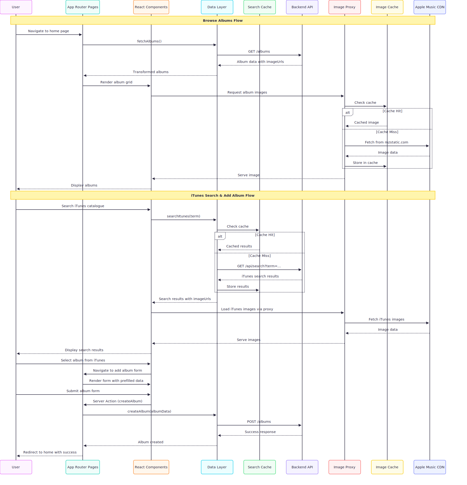

# Motown House

A digital record store for classic Motown albums built with Next.js and TypeScript. Browse, search, and manage a curated collection of vinyl records with iTunes integration.


## Features

- **Browse & Search**: View albums with advanced search across title, artist, genre, and year
- **iTunes Integration**: Search iTunes catalogue and import albums with one click
- **CRUD Operations**: Create, edit, and delete albums with form validation
- **Image Caching**: Fast loading with server-side caching of album artwork
- **Responsive Design**: Works on desktop and mobile

## Architecture

### System Overview

The application follows a modern frontend architecture with clear separation of concerns and efficient caching strategies. The diagram below illustrates the key components, data flow, and integration points within the Next.js application.


### User Flows

The sequence diagram shows the primary user interactions and system processes, highlighting how the caching layers optimize performance for both album browsing and iTunes integration workflows.



## Quick Start

### Prerequisites
- Node.js 18+
- Backend API running on localhost:8080 ([Go Backend](https://github.com/tvergilio/web-service-gin))

### Setup
```bash
# Install dependencies
npm ci

# Start development server
npm run dev

# Open http://localhost:9002
```

## Backend Setup

This app requires the Go backend API:

```bash
git clone https://github.com/tvergilio/web-service-gin.git
# Follow backend setup instructions
# Ensure it runs on localhost:8080 with CORS for localhost:9002
```

## Tech Stack

- **Next.js 15** with TypeScript and App Router
- **Tailwind CSS** + **Radix UI** for styling
- **Zod** for validation
- **Framer Motion** for animations
